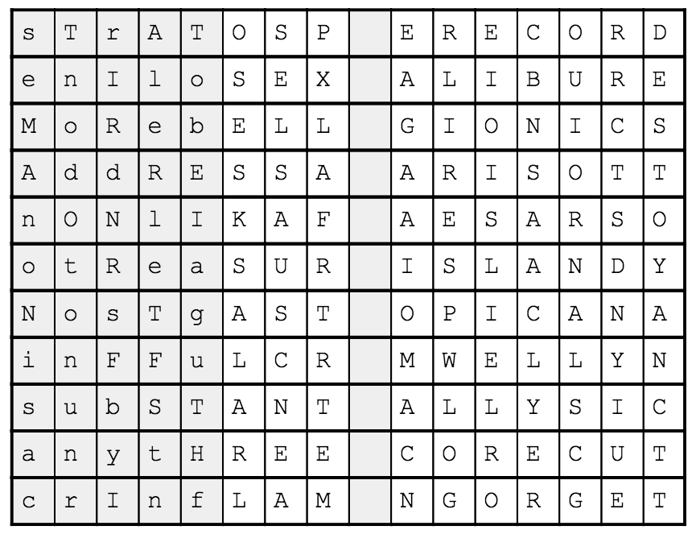
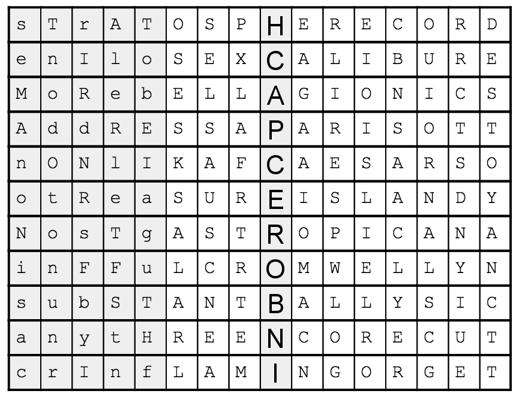

# Apple II

We got this:

It took us some time to understand that the letters missing were part of famous hotels and locations in Las Vegas.

When we figured that out, we took the letters ``HCAPCEROBNI`` and ran them through a couple of online anagram solvers.

I can't find the correct one, but one of those gave us ``BACON CIPHER``. That sounds plausible!

Now, you can read more about [Bacon's cipher here](https://en.wikipedia.org/wiki/Bacon%27s_cipher), but the gist of it is that a set of bits are encoded not as bits, but as "text". So ``sTrAT`` could mean ``01011`` which decodes to an ``L`` (Look at the table on Wikipedia).

So lets do that for all of the gray fields:

    sTrAT = 01011 = L
    enIlo = 00100 = E
    MoReb = 10100 = U
    AddRE = 10011 = T
    nONlI = 01101 = N
    otRea = 00100 = E
    NosTg = 10010 = S
    inFFu = 00110 = G
    subST = 00011 = D
    anytH = 00001 = B
    crInf = 00100 = E

Now if we order those letters in the same order as ``BACONCIPHER``, we get the final key:

``DUNGBEETLES``
