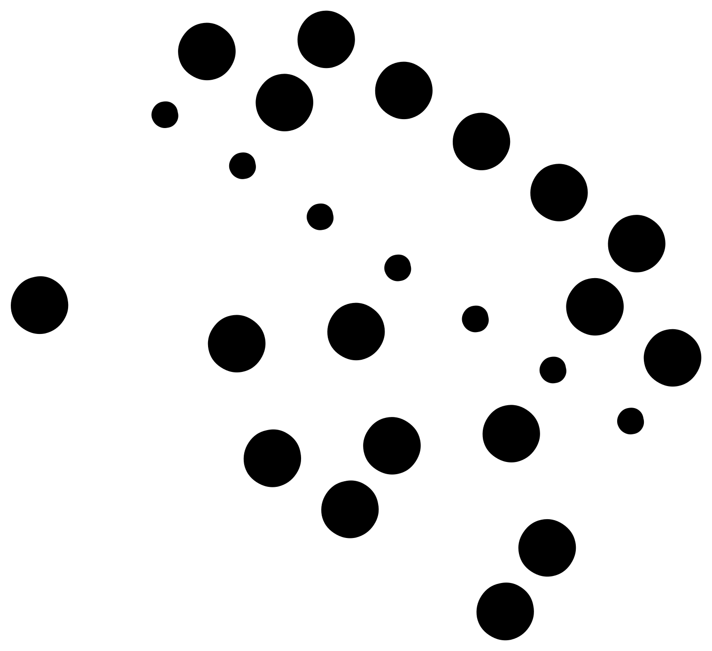
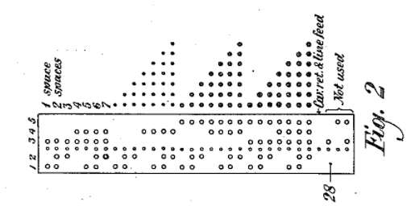
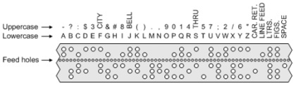

# Coleco Vision

All we get is this image:

Now, to the keen eye, this might look like something from a punch card! We went down that rabbit hole and returned none the wiser. We then asked for help, and the Village made us look extra hard at the keys we had been given.

On the key, we saw a patent number. Hmm, weird. Turns out the patent is for ``Method of and apparatus for secret electrical transmission of pictures`` and in the documents, we found this:

Looks like we are on the right track! Turns out, we were not dealing with any encryption at all. We just had to realize that we are looking at punched tape. Solving it now is as simple as matching it up with the below drawing:

Which gives us the key:

``LADYBUG``
