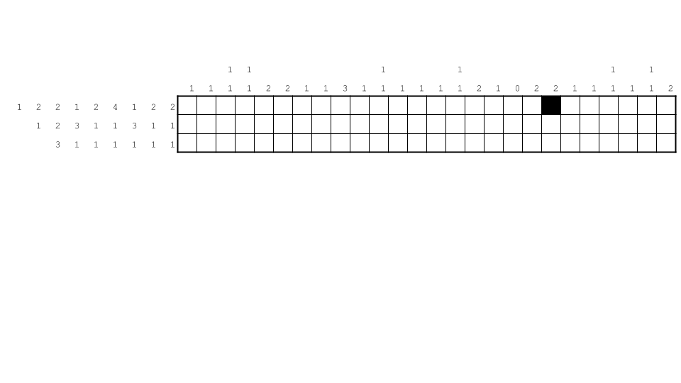
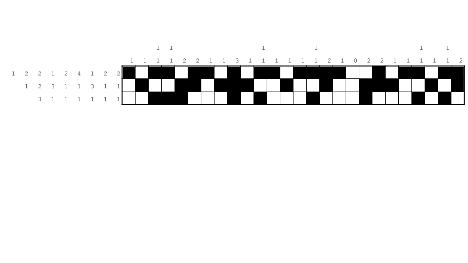
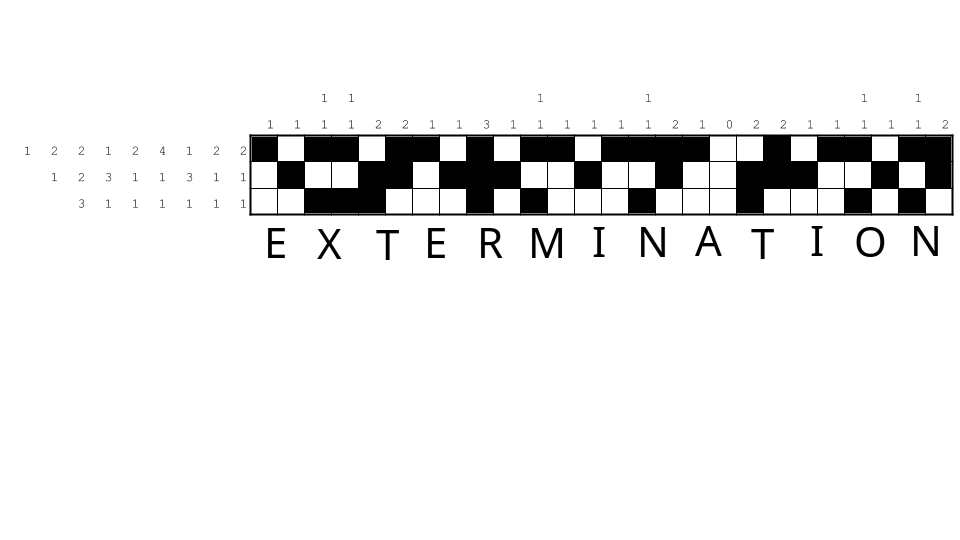

#Playstation 2

For this task, we get the following image:

At first glance, this really looks like a [nonogram](https://en.wikipedia.org/wiki/Nonogram), and after solving it, we get the following result:

If we divide this into sections that are two squares wide and three squares high, we see they seem to be representing [braille](https://en.wikipedia.org/wiki/Braille).
Trying to solve using braille, the result is obvious:

Yielding the solution:

`EXTERMINATION`
