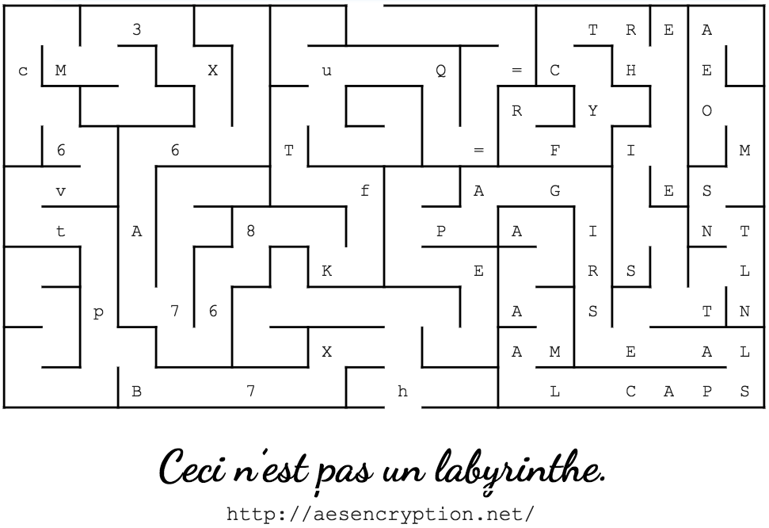

# ZX Spectrum

On the website, there is a single [PDF document](./ZXSpectrum.pdf) embedded.
We download it, and tried to run ```strings``` on it with no luck.

It was first after a long time that we realized that there were "invisible" text in the PDF.

By copying and pasting the text, we get this:

    3 TREA cMXuQ=CHE RYO
    66T =FIM vfAGES tA8PAINT
    KERSL p76 ASTN X AMEAL B7hLCAPS
    Ceci n’est pas un labyrinthe.
    http://aesencryption.net/

It's likely that we need to see the individual location of these letters, maybe they have to be read in the order that the maze can be solved?

By making the text black, we see this:



If we "solve" the maze, we get the base64 string ``hX7Bptv6cM3X6A768KfTuQ==``

Remembering the link in the image, it is easy to assume that this is encrypted using AES, but what is the key?

If we read the text on the right hand side of the image from the top and down, it spells out

``TREACHERY OF IMAGES PAINTERS LAST NAME ALL CAPS``

Alright! On [Wikipedia](https://en.wikipedia.org/wiki/The_Treachery_of_Images) we find that the painter is named "René Magritte", so we use ``MAGRITTE`` as the key, and get the final key:

``WRIGGLER``
